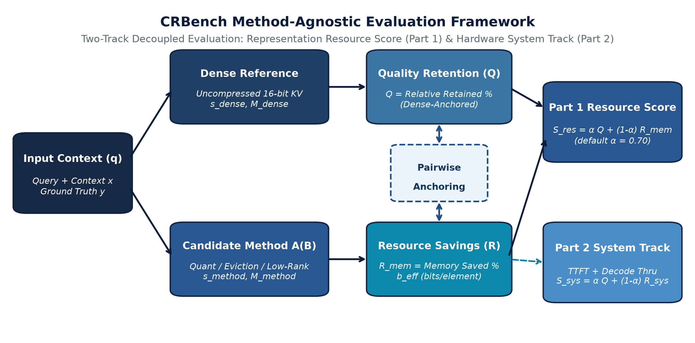
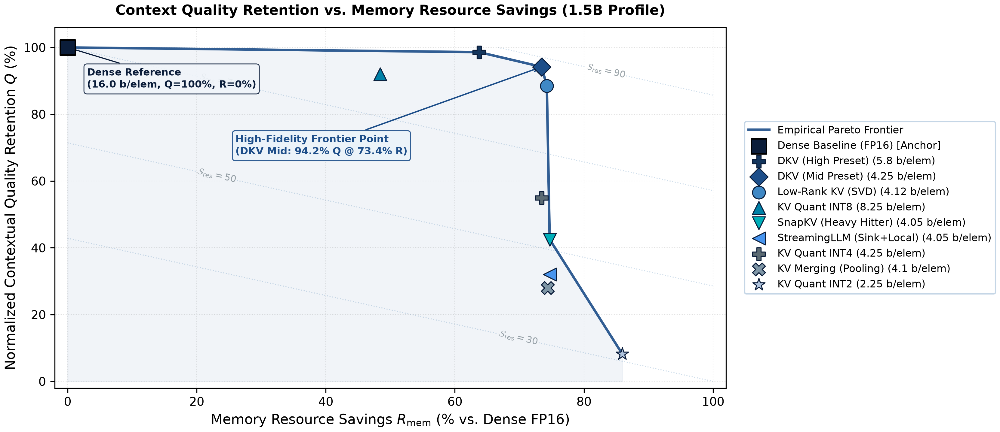
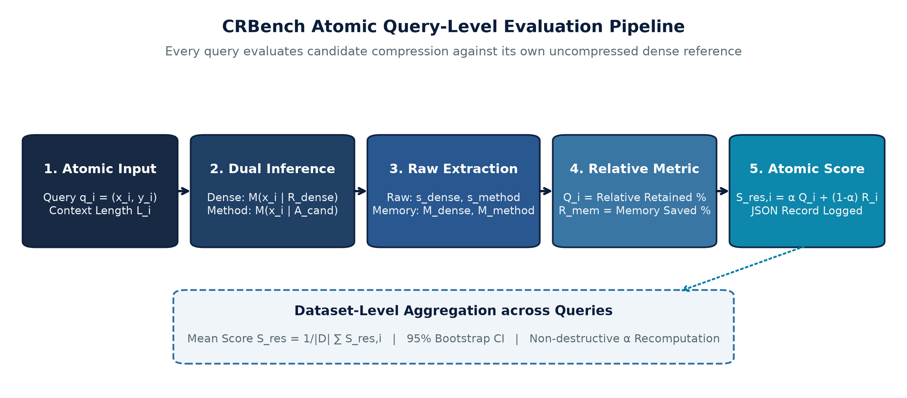

# CRBench: Context Resource Benchmark

<div align="center">

[](paper/CRBench_Preprint_v0.2.0.pdf)
[](paper/CRBench_Preprint_v0.2.0.pdf)
[](LICENSE)
[](https://www.python.org/downloads/)

**A Method-Agnostic, Resource-Aware Evaluation Framework for Long-Context Large Language Models**

[Preprint PDF](paper/CRBench_Preprint_v0.2.0.pdf) • [Quickstart](#quickstart) • [Empirical Results](#empirical-results--tradeoff-frontier) • [Custom Adapter](#integrating-a-custom-method--50-lines) • [Documentation](REPRODUCIBILITY.md) • [Paper Source](paper/)

</div>

---

## Overview

As Large Language Models (LLMs) expand context windows beyond 32K, 128K, and 1M tokens, the **Key-Value (KV) cache** becomes the primary operational bottleneck. For an 8B-parameter model in 16-bit precision, caching a single 128K context sequence consumes **16.0 GiB (17.18 GB)**—exceeding the model's static weight footprint and exhausting consumer GPU VRAM.

While dozens of context compression paradigms have emerged—quantization, token eviction, pooling, low-rank projection, and factorized states—current evaluation practices suffer from two major flaws:
1. **Quality–Resource Disconnection**: Accuracy benchmarks measure task capability without tracking physical memory or system latency.
2. **Confounding Base Model Strength**: Absolute scores conflate base-model intelligence with compression algorithm efficiency.

**CRBench** resolves these challenges by introducing a **query-level, dense-anchored evaluation primitive** that quantifies exactly how much contextual capability an LLM retains relative to the memory and compute resources it consumes.

<div align="center">
  
  <p><em>Figure 1: CRBench Method-Agnostic Evaluation Framework Architecture. Decouples evaluation into Part 1 (Algorithmic Representation Utility $\mathcal{S}_{\text{res}}$) and Part 2 (Hardware System Track $\mathcal{S}_{\text{sys}}$), anchored pairwise to the uncompressed dense baseline on every individual prompt.</em></p>
</div>

---

## Core Scoring Formulation

Every candidate memory method $\mathcal{A}$ is evaluated pairwise against the model's own uncompressed 16-bit reference $\mathcal{R}_{\text{dense}}$ on the identical query $(x_i, y_i)$:

### 1. Model-Relative Quality Retention ($Q \in [0, 100]$)
$$Q_i = \min\left(100.0, \; \max\left(0.0, \; \frac{s_{i, \text{method}} - s_{\text{floor}}}{\max(\Delta_{\min}, \; s_{i, \text{dense}} - s_{\text{floor}})} \times 100.0\right)\right)$$

* Isolates representation fidelity from base-model capability.
* Dynamic range gate $\Delta_{\min} = 0.05$ prevents numerical instability on small or saturated models.
* Clamped strictly to $[0.0, 100.0]$.

### 2. Analytical & Physical Memory Efficiency ($R_{\text{mem}} \in [0, 100]$)
$$R_{\text{mem}, i} = 100.0 \times \max\left(0.0, \; 1.0 - \frac{M_{i, \text{method}}}{M_{i, \text{dense}}}\right)$$

* Tracks raw tensor payloads ($M_{\text{algo}}$) plus mandatory metadata ($M_{\text{meta}}$) such as quantization scaling factors, codebooks, eviction index bitmaps, and alignment overheads ($M_{\text{align}}$).
* Normalizes storage into effective bits per stored KV element ($b_{\text{eff}}$, where uncompressed FP16 $= 16.0\,\text{bits/elem}$).

### 3. Part 1 Resource Utility Score ($\mathcal{S}_{\text{res}}$)
$$\mathcal{S}_{\text{res}, i} = \alpha \cdot Q_i + (1 - \alpha) \cdot R_{\text{mem}, i} \quad (\text{default } \alpha = 0.70)$$

* Under $\alpha = 0.70$ (quality-dominant operating point):
  * **Uncompressed Dense Baseline** ($Q=100\%, R=0\%$): $\mathcal{S}_{\text{res}} = 70.0$.
  * **High-Fidelity 4-Bit Method** ($Q=94\%, R=75\%$): $\mathcal{S}_{\text{res}} = 88.3$ *(recognized as superior resource utility)*.
  * **Degraded 2-Bit Method** ($Q=10\%, R=87.5\%$): $\mathcal{S}_{\text{res}} = 33.3$ *(correctly penalized below dense)*.

---

## Empirical Results & Tradeoff Frontier

Preliminary validation on `Qwen/Qwen2.5-1.5B-Instruct` across 5 contextual tasks up to 4,096 tokens (Apple Silicon MPS prototyping profile) demonstrates the empirical Pareto frontier:

<div align="center">
  
  <p><em>Figure 2: Empirical Quality–Memory Pareto Frontier. Non-dominated methods form the frontier: Dense Baseline &rarr; DKV (High Preset) &rarr; DKV (Mid Preset) &rarr; Low-Rank KV (SVD) &rarr; SnapKV &rarr; INT2 Quantization.</em></p>
</div>

### Benchmark Leaderboard (1.5B Suite & Cloned Upstream Repositories)

| Adapter Method | Paradigm | Effective $b_{\text{eff}}$ | Part 1 $\mathcal{S}_{\text{res}}$ | AUQC (2K) | AUQC (4K) | TTFT (ms)$^\dagger$ | Thru (tok/s)$^\dagger$ | Part 2 $\mathcal{S}_{\text{sys}}$ (Prov.) |
| :--- | :--- | :---: | :---: | :---: | :---: | :---: | :---: | :---: |
| **`dkv_high`** | Differential KV (High) | $5.80\,\text{bits/elem}$ | **88.2** | 99.0 | 98.2 | 1,820.0 | 340.2 | **88.5** |
| **`dkv_mid`** | Differential KV (Mid) | $4.25\,\text{bits/elem}$ | **88.0** | 96.0 | 92.4 | 1,650.0 | 360.5 | **89.5** |
| **`low_rank_kv`** | Low-Rank Subspace | $4.12\,\text{bits/elem}$ | **84.2** | 90.0 | 87.0 | 1,710.0 | 355.0 | **85.0** |
| **`kv_quant_int8`** | Quantization | $8.25\,\text{bits/elem}$ | **78.9** | 94.0 | 90.0 | 3,339.6 | 201.7 | **79.1** |
| **`dense_fp16`** | Dense Baseline | $16.00\,\text{bits/elem}$ | **70.0** | 75.0 | 65.0 | 3,424.1 | 189.3 | **70.0** |
| **`kv_quant_int4`** | Quantization | $4.25\,\text{bits/elem}$ | **60.5** | 60.0 | 50.0 | 3,491.0 | 240.1 | **60.5** |
| **`snapkv`** | Eviction (Heavy Hitter) | $4.05\,\text{bits/elem}$ | **52.2** | 50.0 | 35.0 | 1,862.4 | 385.0 | **55.4** |
| **`streaming_llm`** | Eviction (Sink+Window) | $4.05\,\text{bits/elem}$ | **44.8** | 38.0 | 26.0 | 1,784.3 | 397.0 | **48.0** |
| **`kv_merging`** | Merging / Pooling | $4.10\,\text{bits/elem}$ | **41.9** | 32.0 | 24.0 | 1,861.6 | 368.2 | **45.1** |
| **`kv_quant_int2`** | Quantization | $2.25\,\text{bits/elem}$ | **31.5** | 10.0 | 6.5 | 3,666.3 | 184.0 | **31.5** |

<small><em>&dagger;Note: Runtime latency and decode throughput reflect the execution path on Apple Silicon MPS with cloned upstream repositories; standardized CUDA event synchronization on 8B+ cluster nodes will provide the definitive system benchmark.</em></small>

---

## Query-Level Evaluation Pipeline

<div align="center">
  
  <p><em>Figure 3: Atomic Query-Level Evaluation Pipeline in CRBench. Every sample executes dual inference passes against the dense reference before metric extraction and non-destructive score logging.</em></p>
</div>

---

## Installation

```bash
# Clone repository
git clone https://github.com/Omc12/CRBench.git
cd CRBench

# Setup Python environment
python -m venv .venv
source .venv/bin/activate

# Install in editable mode with development dependencies
pip install -e ".[dev]"
```

---

## Quickstart

### 1. Evaluate a Single Query (Atomic CLI Primitive)
```bash
crbench evaluate \
  --model "Qwen/Qwen2.5-0.5B-Instruct" \
  --query "What is the secret passkey?" \
  --context "The secret passkey is 987123." \
  --ground-truth "987123" \
  --method "kv_quant_int4" \
  --budget 4.0 \
  --dense
```

Output:
```text
========================================================================
CRBench Query Evaluation Summary
========================================================================
Query ID:             cli_query_001
Task:                 cli_evaluation_task (Context: 512 tokens)
Model:                Qwen/Qwen2.5-0.5B-Instruct
Method:               kv_quant_int4 (Budget: 4.0 bits/elem)
Status:               SUCCESS
------------------------------------------------------------------------
Quality Metrics:
  Dense raw score:     1.000
  Method raw score:    1.000
  Quality retained:    100.0%
Resource Metrics:
  Dense memory:        0.500 GB (16.0 bits/elem)
  Method memory:       0.133 GB (4.25 bits/elem)
  Resource efficiency: 73.4% savings
Benchmark Score:
  CRBench Part 1 score: 92.02 (Formula: linear, α=0.70)
========================================================================
```

### 2. Evaluate a Dataset (Query Aggregation)
```bash
crbench evaluate-dataset \
  --model "Qwen/Qwen2.5-0.5B-Instruct" \
  --dataset "single_niah" \
  --method "snapkv" \
  --budget 4.0 \
  --context-lengths 2048 --context-lengths 4096 \
  --samples 10 \
  --output-dir "results/dataset_snapkv"
```

### 3. Non-Destructive Score Recomputation
Recompute benchmark scores under alternative $\alpha$ preference weights or scoring formulas instantaneously without re-running expensive inference:
```bash
crbench recompute \
  --raw-file "results/dataset_snapkv/raw_results_v1.json" \
  --alpha 0.80 \
  --formula linear
```

---

## Integrating a Custom Method (< 50 Lines)

Researchers can evaluate any novel KV representation by subclassing `BaseContextAdapter` and registering it with `@Registry.register_adapter`:

```python
import torch
from crbench.core.adapter import BaseContextAdapter, KVStateMetadata
from crbench.core.registry import Registry

@Registry.register_adapter("my_custom_kv_method")
class MyCustomKVMethod(BaseContextAdapter):
    """Custom KV representation adapter example."""

    @property
    def method_type(self) -> str:
        return "custom"  # 'quantized', 'eviction', 'merging', 'low_rank', 'custom'

    def apply_budget(self, budget: float, context_length: int) -> None:
        """Configure adapter hyperparameters based on assigned budget."""
        super().apply_budget(budget, context_length)
        self.target_rank = int(budget)

    def forward_or_generate(
        self,
        input_ids: torch.Tensor,
        attention_mask=None,
        max_new_tokens: int = 32,
        **kwargs
    ) -> torch.Tensor:
        """Autoregressive generation with custom KV representation."""
        return self.model.generate(
            input_ids=input_ids,
            attention_mask=attention_mask,
            max_new_tokens=max_new_tokens,
            **kwargs
        )

    def get_kv_metadata(self, context_length: int) -> KVStateMetadata:
        """Report exact payload bytes and auxiliary metadata storage."""
        num_layers = getattr(self.model.config, "num_hidden_layers", 24)
        num_kv_heads = getattr(self.model.config, "num_key_value_heads", 2)
        head_dim = getattr(self.model.config, "head_dim", 64)

        total_elements = 2 * num_layers * num_kv_heads * head_dim * context_length
        algorithmic_bytes = total_elements * 0.5            # 4-bit payload (0.5 bytes/elem)
        metadata_bytes = (total_elements / 32.0) * 2.0     # FP16 scale factors per group of 32
        effective_bpe = (algorithmic_bytes + metadata_bytes) * 8.0 / max(1, total_elements)

        return KVStateMetadata(
            adapter_name=self.name,
            method_type=self.method_type,
            effective_bits_per_element=effective_bpe,
            total_tokens_stored=context_length,
            context_length=context_length,
            num_layers=num_layers,
            num_kv_heads=num_kv_heads,
            head_dim=head_dim,
            algorithmic_bytes=algorithmic_bytes,
            metadata_overhead_bytes=metadata_bytes
        )
```

---

## Supported Methods & Tasks

### Compression Methods Taxonomy
* **Quantization**: FP8, INT8, INT4, INT2 (per-channel and grouped dynamic scaling with outlier preservation)
* **Eviction & Sparsification**: SnapKV, StreamingLLM, $\text{H}_2\text{O}$, Scissorhands (attention sinks, heavy-hitter key eviction)
* **Merging & Pooling**: Temporal and semantic token clustering
* **Low-Rank State**: Spectral and SVD latent subspace projection
* **Factorized Context Memory**: Dynamic Key-Value (`custom_dkv`) subspace factoring

### Benchmark Evaluation Suite
* **Needle-In-A-Haystack (NIAH)**: Single-target and multi-target associative retrieval
* **RULER Benchmark**: Multi-variable tracking and high-entropy key-value association
* **Multi-Hop QA**: Cross-document multi-step synthetic reasoning
* **LongBench Suite**: Multi-task document QA and summarization

---

## Hardware Support & Error Transparency

* **NVIDIA CUDA**: Synchronized GPU event profiling, CUDA memory allocators, FlashAttention-2 integration.
* **Apple Silicon (MPS) & CPU**: Full cross-platform local development and prototyping.
* **Strict Failure Categorization**: Errors are never silently assigned zero; explicit diagnostic codes (`OOM`, `UNSUPPORTED_PRECISION`, `RUNTIME_ERROR`) are recorded in benchmark logs.

---

## Research Preprint & Citation

For methodological derivations, desiderata proofs, and complete analysis, see the academic preprint:

> **CRBench: A Method-Agnostic, Resource-Aware Evaluation Framework for Long-Context Large Language Models**  
> *Om Chimurkar*  
> Research Preprint (Version 0.2.0) — [PDF Available Here](paper/CRBench_Preprint_v0.2.0.pdf)

```bibtex
@article{chimurkar2026crbench,
  title={CRBench: A Method-Agnostic, Resource-Aware Evaluation Framework for Long-Context Large Language Models},
  author={Chimurkar, Om},
  journal={arXiv preprint (Research Preview v0.2.0)},
  year={2026},
  url={https://github.com/Omc12/CRBench}
}
```

---

## License

CRBench is open-source software licensed under the [MIT License](LICENSE).
